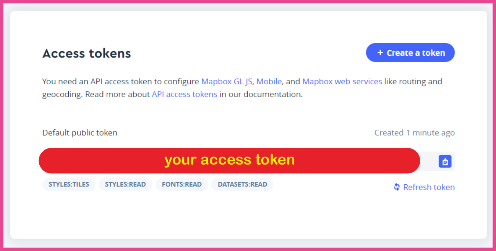

1. Install Mapbox package for React Native
    ```bash
        $ npm i @mapbox/react-native-mapbox-gl
    ```

2. Go to __*yourProject/android/build.gradle*__
    ```java
    allprojects {
        repositories {
            jcenter()
            maven { url "$rootDir/../node_modules/react-native/android" }
            maven { url "https://jitpack.io" }
            maven { url "https://maven.google.com" }
        }
    }
    ```

3. Go to __*yourProject/android/app/build.gradle*__
    ```java
    dependencies {
        compile (project(':mapbox-react-native-mapbox-gl')) {
            compile ('com.squareup.okhttp3:okhttp:3.6.0') {
                force = true
            }
        }
    }
    ```

4. Go to __*yourProject/android/settings.gradle*__
    ```java
    include ':mapbox-react-native-mapbox-gl'
    project(':mapbox-react-native-mapbox-gl').projectDir = new File(rootProject.projectDir, '../node_modules/@mapbox/react-native-mapbox-gl/android/rctmgl')
    ```

5. Go to __*yourProject/android/app/src/main/java/com/yourProject/MainApplication.java*__

    insert after ```import com.facebook.soloader.SoLoader```:
    ```java
    import com.mapbox.rctmgl.RCTMGLPackage;
    ```

    insert inside ```getPackages()``` after ```new MainReactPackage(),```
    ```java
    new RCTMGLPackage()
    ```

6. Sign up to [mapbox.com](https://www.mapbox.com/) & get your access token!
    
    